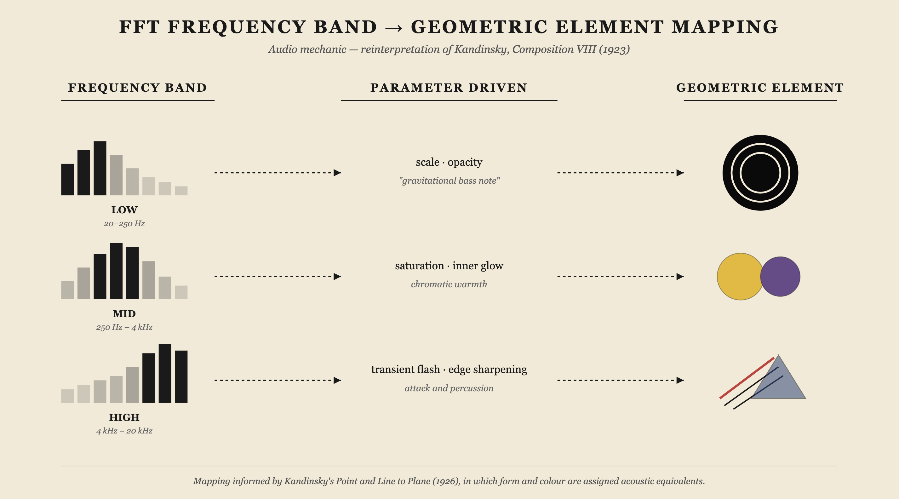

# IDEA9103 Major Project 

## Part 1: Project Direction
Our project draws inspiration from Wassily Kandinsky’s __Composition VIII (1923)__, a defining work of geometric abstract art that explores rhythm, emotion, and the relationship between colour and sound through circles, lines, and geometric forms. Kandinsky believed that painting could evoke feelings similarly to music, and this connection between visual art and sound became the core inspiration for our project.

We aim to transform this static abstract painting into a dynamic interactive artwork where viewers can influence geometric elements through sound, mouse interaction, and time-based changes. We were also inspired by Google Arts & Culture’s Play a Kandinsky project, as well as generative art and abstract motion graphics, to create an immersive audiovisual experience that combines movement, rhythm, and interaction.

*Wassily Kandinsky, Composition VIII, 1923, oil on canvas, 140 × 201 cm. Solomon R. Guggenheim Museum, New York.*

*Google Arts & Culture & Centre Pompidou, Play a Kandinsky, 2021.*

---

## Part 2: Mechanics
### Team Members

| Name | uid | Mechanic |
|------|--------|----------|
| Jingyi Long | [jlon6684](https://github.com/Jingyi-Long) | Audio |
| Yuming Cong | [ycon0930](https://github.com/MiiiiinG03) | Time-based |
| Zichen Feng | [zfen0688](https://github.com/zf0688) | Perlin noise & randomness |
| Xiaoyu Xia | [xxia0518](https://github.com/xxia0518) | User input |

### Audio — owned by Jingyi Long
The audio mechanic uses the p5.sound FFT analyser to break an audio track into three frequency ranges: low, mid, and high. Each range controls a different group of shapes from the painting. Low frequencies drive the large black concentric circle in the upper left, making it expand and pulse like a bass note. Mid frequencies adjust the brightness of the yellow and violet discs, so the warm colours respond to melody. High frequencies trigger short flashes along the diagonal lines and sharpen the triangles, matching sudden notes or percussion. The user experiences the piece by pressing a key to start the audio, then watching the canvas react in real time. 

### Time-based — owned by Yuming Cong
Our project was inspired by Wassily Kandinsky’s belief that **painting could function like music through rhythm, emotion, and composition.** In Composition VIII, geometric forms, lines, and colours are arranged with a strong sense of visual rhythm. In our group project, I am responsible for designing the time-based visual evolution of the system, using alpha blending to support continuous trajectory retention.

This mechanic is structured through stages similar to musical progression: **introduction, build-up, climax, and resolution.**
At the beginning, the composition remains minimal and balanced. Large concentric circles drift slowly and expand gently, while diagonal lines move with subtle oscillation. Trails are short-lived and quickly fade, maintaining a clear and spacious composition.
As the visual rhythm develops, circles pulse more frequently, lines overlap and shift direction, and triangles rotate faster to increase visual tension. Movement becomes more active, and trails last longer, gradually building visual density through overlapping paths. Additional geometric forms and particles also begin to appear, creating more layered and complex movement.
During the climax stage, motion and interaction reach their highest intensity. Trails persist and accumulate, forming a dense layered “memory” of movement, while colour contrast becomes stronger and the overall composition becomes more dynamic.
Finally, in the resolution stage, movement gradually slows and trails begin to fade again, returning the composition to a calmer and more balanced state.

The user will not directly interact with this mechanic, but instead experience the artwork continuously evolving over time.

### Perlin Noise & Randomness — owned by Zichen Feng
This mechanic uses Perlin noise and random numbers to create smooth and organic dynamic effects. Inspired by the rhythm and geometric balance in Kandinsky's "Composition VIII", the circles, lines and particles in the picture will slowly float, rotate and constantly change positions. Compared with completely random movements, Perlin noise can produce more natural and smooth change effects, making the entire picture look more alive and fluid, rather than chaotic. 
The audience will experience this mechanic by observing the constantly changing dynamic environment. Random numbers and random seeds will affect color changes, particle generation, and graphic distribution, making the work continuously evolve and each presentation slightly different. The audience can feel the constantly changing visual rhythm and spatial relationship between geometric elements. 
This mechanic echoes the project concept in Part 1. We aim to transform Kandinsky's originally static abstract paintings into a dynamic and immersive digital art space. Perlin noise and random variations further enhance the sense of movement, rhythm and musicality in the work, allowing the image to flow and change continuously like music.

### User Input — owned by Xiaoyu Xia

The user input mechanic allows the audience to directly interact with the geometric composition through mouse movement and clicks, inspired by Google Arts & Culture's *Play a Kandinsky* project and Kandinsky's synesthesia colour theory.

When the mouse moves across the canvas, nearby geometric shapes respond to the cursor's proximity. Circles expand outward or produce ripple effects, lines bend or oscillate, and triangles rotate or shift colour. The closer the cursor is to a shape, the stronger the visual response; when the mouse moves away, shapes gradually return to their original state.

Different colour regions react in distinct ways based on Kandinsky's colour-sound associations. Yellow areas respond with quick, energetic movements, reflecting Kandinsky's association of yellow with trumpets. Blue areas react more slowly and softly, echoing the calm of an organ. Red areas produce moderate, balanced responses in between the two.

Additionally, clicking on the canvas sends a ripple wave outward from the click position. As the wave passes through geometric elements, each shape briefly reacts, creating the sensation of "playing" the painting like a musical instrument.

This mechanic is the only one that requires active participation from the viewer, complementing the automatic behaviours of the audio, time-based, and Perlin noise mechanics. It gives the audience a sense of personal agency and transforms the experience from passive observation into direct creative engagement with Kandinsky's visual language.

*Google Arts & Culture, Play a Kandinsky, 2021. Users can click on different colour regions of Kandinsky's Yellow-Red-Blue to hear the sounds he associated with each colour and shape.*

## Part 3: Putting It Together 
The four mechanics share the same Kandinsky canvas, each controlling a different layer rather than a separate region. Time-based motion sets the underlying rhythm, Perlin noise adds organic variation to positions and colours, audio reshapes the forms through three frequency bands, and user input lets the viewer disturb nearby elements. They influence each other through shared geometric objects, so a single circle can pulse to the bass, drift over time, and still react to the mouse. What holds the piece together is Kandinsky's own logic: one colour palette, the original geometric vocabulary, and his idea of painting as visual music.

## References

Google Arts & Culture and Centre Pompidou (2021) *Play a Kandinsky*. Available at: https://artsandculture.google.com/experiment/play-a-kandinsky/sgF5ivv105ukhA (Accessed: 14 May 2026).

Hodgin, R. (2022) *Ancient Courses of Fictional Rivers* [Generative artwork]. Art Blocks. Available at: https://www.artblocks.io/collection/ancient-courses-of-fictional-rivers-by-robert-hodgin.

Kandinsky, W. (1923) *Composition VIII* [Oil on canvas, 140 × 201 cm]. Solomon R. Guggenheim Museum, New York. Available at: https://www.guggenheim.org/artwork/1924.

Kandinsky, W. (1979) *Point and Line to Plane*. Trans. H. Dearstyne and H. Rebay. New York: Dover Publications. (Original work published 1926).

McCarthy, L. (2023) p5.sound library. p5.js. Available at: https://p5js.org/reference/#/libraries/p5.sound.

p5.js (2024) p5.js Reference. Processing Foundation. Available at: https://p5js.org/reference/.

