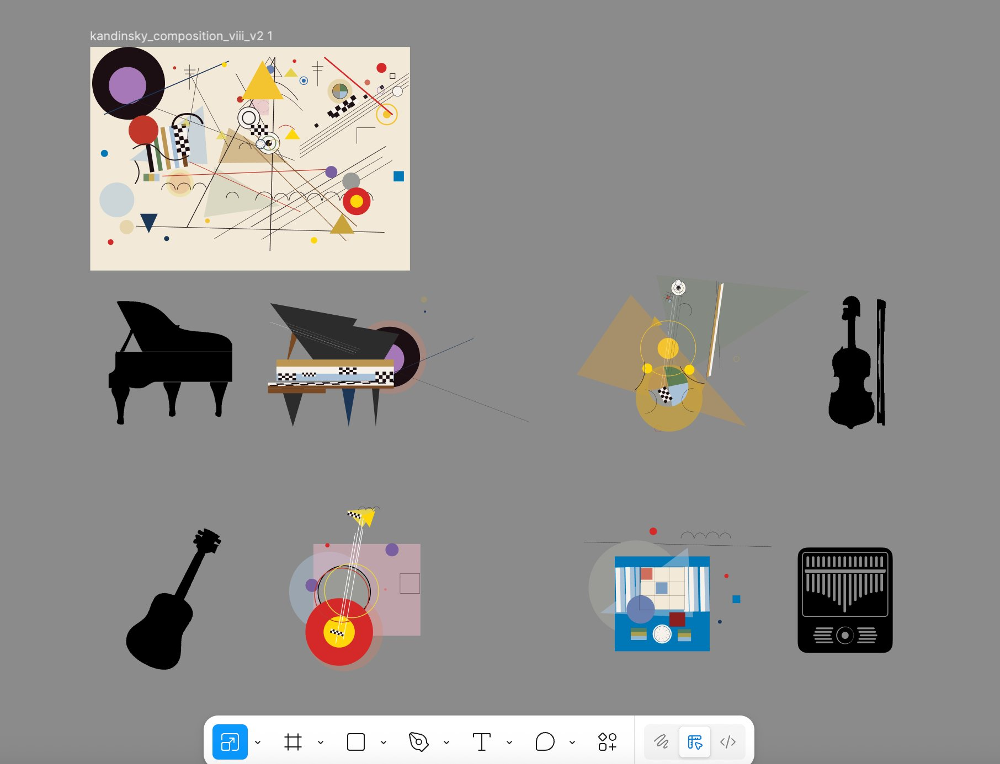

# IDEA9103 Major Project 

## Part 1: Project Overview
An interactive audiovisual reinterpretation of Wassily Kandinsky's Composition VIII (1923), built with p5.js. The static painting is rebuilt from SVG geometry and then brought to life: over a timed sequence the shapes draw themselves in and gain colour, the viewer can gather the composition into four musical instruments, and the whole scene reacts in real time to a synchronised recording of Pachelbel's Canon in D. Four mechanics — Audio, Time-based, Perlin noise & randomness, and User input — each drive a different layer of the same canvas.

## Inspiration
 
Our project draws inspiration from Wassily Kandinsky's **Composition VIII (1923)**, a defining work of geometric abstract art that explores rhythm, emotion, and the relationship between colour and sound through circles, lines, and geometric forms. Kandinsky believed that painting could evoke feelings in the same way as music, and this connection between visual art and sound became the core idea of our project.
 
We transform this static abstract painting into a dynamic interactive artwork where viewers can influence the geometric elements through sound, mouse interaction, and time-based change. We were also inspired by Google Arts & Culture's *Play a Kandinsky* project, as well as generative art and abstract motion graphics, to create an immersive audiovisual experience that combines movement, rhythm, and interaction.
 

*Wassily Kandinsky, Composition VIII, 1923, oil on canvas, 140 × 201 cm. Solomon R. Guggenheim Museum, New York.*

*Google Arts & Culture & Centre Pompidou, Play a Kandinsky, 2021.*

---

## How to Run

1. The project loads local audio (`.mp3`) and SVG files, so it must be **served**, not opened directly as a `file://` page. In VS Code, open the `version 14` folder and run `index.html` with the **Live Server** extension (or any local web server).
2. Wait for the audio to finish loading — the on-screen indicator changes from `audio loading …%` to `♪ click to start canon`.
3. **Click anywhere once** (or press any key, or start dragging). Browsers block audio until a user gesture, so this first interaction starts the synchronised *Canon in D* soundtrack and the timed sequence.
4. The piece is responsive and re-scales when the browser window is resized.

## Interaction Instructions

The work layers four mechanics on one canvas — some run on their own, others respond to you.

**Just watch (Time-based + Audio):**
- After the first interaction, the painting plays through a roughly **98-second timed sequence**: shapes appear as outlines, fill with colour as saturation rises, oscillate at the climax, then fade out and loop.
- The instruments react to the music in real time — each one's **brightness and colour flicker** with its own frequency band of the soundtrack.

**Mouse / trackpad:**
- **Move the mouse** over the painting — nearby shapes respond to the cursor: circles breathe and ripple, lines bend and stretch, triangles spin and warm toward orange, rectangles tilt. Background particles drift away from the cursor and the formed instruments lean toward it.
- **Drag** (hold and move) to gather the composition into the four instruments; **release** to let it return. A fast flick assembles strongly (*forte*); a slow drag is gentle (*piano*).
- **Scroll / two-finger swipe** is a second way to control the same assembly — handy on a trackpad.
- **Click** anywhere to send an expanding ripple across the shapes and play a short note (its pitch follows the horizontal click position on a C-major pentatonic scale, its octave the vertical position). Clicking inside a specific instrument's area toggles just that instrument.

**Keyboard:**
- **1 / 2 / 3 / 4** — show / hide Piano / Violin / Guitar / Music box individually.
- **5** — gather all four instruments at once.
- **0** — return to the original Composition VIII.
- **L** or **Space** — lock / unlock the current state.

*Accessibility: if your system has "reduce motion" enabled, the drag and mouse-proximity reactions are automatically disabled.*

---

## Techniques
 
- **p5.js core:** `noise()`, `noiseSeed()`, seeded randomness, `map()`, `frameCount`, and responsive `windowResized()` / `resizeCanvas()`.
- **Layered rendering:** the original painting (SVG/DOM), a particle canvas, and a glow canvas are stacked so each mechanic owns its own visual layer and does not overwrite the others.
- **Modular structure:** each mechanic lives in its own file and `main.js` brings them together; the mechanic files read/write a small set of shared state (assembly amount, published audio levels, time-reveal values) instead of touching each other directly.
- **Web Audio API (beyond the course):** the five instrument stems are played on a single shared `AudioContext` clock so they stay sample-accurately in sync, and an `AnalyserNode` reads the live frequency spectrum to drive the visuals. The Week 12 tutorial covered `p5.sound`'s `p5.FFT` / `p5.Amplitude`; we used the lower-level Web Audio API instead because `p5.sound`'s `loadSound().loop()` cannot guarantee sample-accurate multi-track synchronisation (see References).
- **Key visual decision:** rather than fading a whole instrument image in as one layer, each instrument SVG is split into many pieces in JavaScript that gather into the final shape, giving a more deliberate "assembling" motion.

---

## Mechanics
### Team Members

| Name | uid | Mechanic |
|------|--------|----------|
| Jingyi Long | [jlon6684](https://github.com/Jingyi-Long) | Audio |
| Yuming Cong | [ycon0930](https://github.com/MiiiiinG03) | Time-based |
| Zichen Feng | [zfen0688](https://github.com/zf0688) | Perlin noise & randomness |
| Xiaoyu Xia | [xxia0518](https://github.com/xxia0518) | User input |

### Audio — owned by Jingyi Long
The audio mechanic plays Pachelbel's *Canon in D* as **five aligned stems** (full ensemble + piano, violin, guitar, music box). All five are loaded through the Web Audio API and started at the same `AudioContext` time, so they behave like stems on one shared timeline and never drift apart. The mix is dynamic: when no instrument is gathered, the ensemble plays as background; as instruments form, the ensemble ducks down and each instrument's own stem fades up.
 
For the audio-reactive visuals, an `AnalyserNode` taps the master output and the live spectrum is split into **four frequency bands** (low → high) mapped to piano / guitar / violin / music box. Because *Canon in D* is gentle and its loudness barely changes, each band's energy is normalised against a slow-moving baseline and amplified by a sensitivity factor, so even small musical swells become visible. The resulting per-instrument level drives a **brightness / saturation / glow flicker** on that instrument, so each one visibly pulses with its own part of the music. This brings Kandinsky's idea — that shapes and colours can behave like sound — to life by letting the real audio move the forms on screen.

### Time-based — owned by Yuming Cong
Our project was inspired by Wassily Kandinsky's belief that **painting could function like music — through rhythm, emotion, and composition.** In Composition VIII, geometric forms, lines, and colours are arranged with a strong sense of visual rhythm. In our group project, I am responsible for designing the time-based visual evolution of the system, using layered alpha compositing across multiple canvas layers to create a continuous sense of depth and presence.

This mechanic is structured through stages analogous to musical progression: **introduction, build-up, climax, and resolution.**

At the beginning, the composition remains minimal and balanced. Geometric outlines emerge one by one across the canvas — sparse, weightless, and without colour — establishing a clear and spacious visual foundation. During the build-up, colour gradually fills each shape while saturation steadily rises, transforming the skeletal composition into a richly hued arrangement. Visual density increases as overlapping forms accumulate and the palette deepens toward full intensity.

During the climax, motion and layering reach their highest intensity. Shapes oscillate in scale with individual rhythms, creating a pulsing, breathing quality across the composition. New geometric elements — curved lines, straight lines, circles, and rotating triangles — emerge and animate with small-amplitude oscillation, while radial bloom gradients expand outward from selected shapes, building a luminous and layered visual field. Colour contrast is at its strongest and the overall composition is most dynamic. Finally, in the resolution stage, bloom and fill colour fade first, dissolving the richness of the scene, followed by the gradual disappearance of all outlines, returning the composition to silence and stillness before the cycle begins again.

The user does not directly interact with this mechanic, but instead experiences the artwork continuously evolving over time.

### Perlin Noise & Randomness — owned by Zichen Feng
This mechanism utilises p5.js’s Perlin noise to create **smooth, natural dynamic effects**. In this project, Perlin noise primarily controls the **slight floating of instruments once formed, the drifting motion of circular particles**, and the faint, breathing halo around the instruments. Compared to completely random movement, the variations in Perlin noise are more continuous, making the animation appear softer, more organic and more lifelike.

Random numbers are mainly used to set the particles’ **initial size, position, opacity and distribution**, so the visual result does not look too repetitive. When the user drags the screen, selected background elements gradually coalesce to form musical instruments, while the elements that have been used dissipate into layered circular particles. These particles do not move in a harsh or mechanical way; instead, Perlin noise gives them a gentle drifting quality, similar to floating dust or sound waves spreading through space.

The breathing halo around each formed instrument also supports the musical feeling of the work. It suggests that the instruments are not static objects, but active visual elements that respond to rhythm and movement. Through this mechanic, Kandinsky’s originally static geometric composition is transformed into an **interactive audiovisual experience characterised by movement, rhythm, spatial depth and musicality**

### User Input — owned by Xiaoyu Xia

The user input mechanic translates keyboard presses, dragging, scrolling, and cursor movements into dynamic control signals that reshape the entire canvas in real time. It is grounded in **Kandinsky's theories of synesthesia and "inner necessity"** (Kandinsky, 1911; 1926) — the belief that a single artistic core can be expressed through different visual and auditory forms. Our choice of Pachelbel's *Canon in D*, played through four separate instrument stems each deconstructed and reassembled from the painting, mirrors this belief that different instruments are different spiritual "colours" of the same melodic truth.
 
To realise this idea, **I personally designed all the instrument assets in Figma** (see Figure 1): the abstract elements of *Composition VIII* were broken down at their foundational geometric level and reassembled into four playable instrument silhouettes (Benjamin, 1989). The viewer's inputs then drive these assets between their dispersed painting state and their fully-assembled instrument state.
 
**Figure 1**
*Figma Asset Blueprint of Instrument Deconstruction and Assembly — designed and exported by Xiaoyu Xia*
 

 
*Note.* The original *Composition VIII* (top) is deconstructed and reassembled into Grand Piano, Violin, Guitar, and Kalimba (Music Box), each with a matching black silhouette as its final-state target. All assets were designed in Figma and exported as SVG for the p5.js runtime.
 
When the cursor moves across the canvas, nearby shapes react with distinct behaviours: **circles** breathe and emit glowing ripple rings, **lines** (converted to quadratic Béziers) bend perpendicular to themselves toward the cursor, **triangles** spin faster and warm toward orange, and **rectangles** tilt toward or away from the pointer (Snibbe & Levin, 2001). A custom spring-damper function ensures every shape settles smoothly back to its original layout once the cursor leaves. The mapping also follows Kandinsky's colour–sound synesthesia: yellow regions react energetically (his "trumpet"), blue regions slowly and softly (his "organ"), and red regions in between.
 
**Clicking anywhere on the canvas** turns the painting into a playable instrument (Cytowic, 2002): a circular ripple wave expands from the click point, momentarily amplifying every shape it passes through, while a short pitched note is synthesised via the Web Audio API — the X-position maps to a C-major pentatonic scale, the Y-position controls the octave. Combined with the keyboard toggles and drag-controlled assembly strength already described in the project's Interaction Instructions, this gives the audience a strong sense of literally "playing" Kandinsky's composition. Accessibility settings are respected throughout: motion-heavy reactions are disabled for users with `prefers-reduced-motion` enabled.
 

## Part 3: Putting It Together 
The four mechanics share the same Kandinsky canvas, each controlling a different layer rather than a separate region. Time-based motion sets the underlying rhythm, Perlin noise adds organic variation to positions and colours, audio reshapes the forms through three frequency bands, and user input lets the viewer disturb nearby elements. They influence each other through shared geometric objects, so a single circle can pulse to the bass, drift over time, and still react to the mouse. What holds the piece together is Kandinsky's own logic: one colour palette, the original geometric vocabulary, and his idea of painting as visual music.

## External References
 
- **MDN Web Audio API** — `AudioContext`, `AudioBufferSourceNode`, `AnalyserNode`, `GainNode`: <https://developer.mozilla.org/en-US/docs/Web/API/Web_Audio_API> — used for the synchronised multi-stem playback and the live spectrum analysis, which go beyond the `p5.sound` material taught in class.
- **p5.js `p5.FFT` / `p5.Amplitude`** (Week 12 tutorial) — the audio-reactive concept (frequency bands driving visuals) follows this tutorial; we reproduced it with the lower-level Web Audio API.
- **p5.js noiseSeed()**— https://p5js.org/reference/p5/noiseSeed/ — used to keep the Perlin noise movement stable and repeatable across runs.
- **Google Arts & Culture & Centre Pompidou, *Play a Kandinsky*, 2021** — <https://artsandculture.google.com/experiment/play-a-kandinsky/sgF5ivv105ukhA>
- **Robert Hodgin, *Ancient Courses of Fictional Rivers*, 2022** — <https://www.artblocks.io/collection/ancient-courses-of-fictional-rivers-by-robert-hodgin> (trail / accumulation inspiration for the time-based mechanic).
- **Robert Hodgin, Ancient Courses of Fictional Rivers, 2022**, Art Blocks — https://www.artblocks.io/collection/ancient-courses-of-fictional-rivers-by-robert-hodgin — used as inspiration for generative visual movement, layered particle aesthetics, and time-based accumulation.

## Academic References

- **Benjamin, A.** (1989). Deconstruction and art/art and deconstruction. In *What is deconstruction?* (pp. 38–47). Academy Editions.
- **Cytowic, R. E.** (2002). *Synesthesia: A union of the senses* (2nd ed.). MIT Press.
- **Kandinsky, W.** (1946). *Concerning the spiritual in art* (H. Rebay, Trans.). Solomon R. Guggenheim Foundation. (Original work published 1911).
- **Kandinsky, W.** (1979). *Point and line to plane* (H. Dearstyne & H. Rebay, Trans.). Dover Publications. (Original work published 1926).
- **Snibbe, S. S., & Levin, G.** (2001). Interactive dynamic abstraction. *Proceedings of the 14th Annual ACM Symposium on User Interface Software and Technology*, 21–30. https://doi.org/10.1145/502348.502353
 
## AI Usage Statement
We used Claude (Anthropic) to assist with parts of the code.

Yuming Cong used ChatGPT to generate the image of the sketch.

Zichen Feng used ChatGPT to support idea development, code troubleshooting, and wording refinement.

Xiaoyu Xia used Gemini, Cursor + Codex, and Claude (Anthropic) iteratively throughout the development of the User Input mechanic to refine creative ideas, brainstorm design directions, and continuously improve the implementation. All final design decisions, Figma asset creation, and conceptual framing were made by the author.
